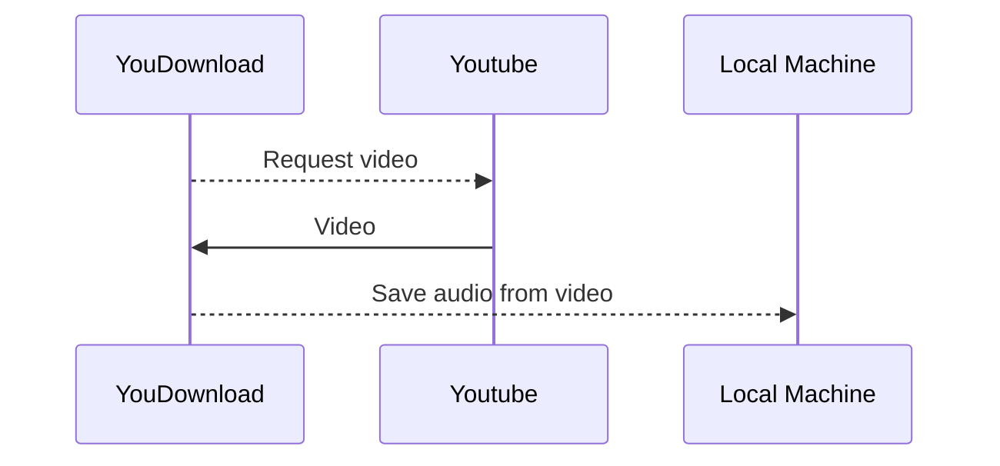

# YouDownload

Download music from youtube. I made this because I was fed up with all the advertisements and loss of music quality when attepting to download YouTube songs from over the internet. This package creates a local web application that allows you to paste a Youtube url into the UI to extract the audio from a Youtube video.  The audio is subsequently saved in `$CWD/www/yd/songs/mp3/` where `CWD=$(pwd)` of the git repo on your local machine.

## Live website :)
Check out the website (give it a minute to load LOL it runs on a free server!!) :: [YouDownload.com](https://playlist-projectv0.herokuapp.com)
Just go find a song you like on YouTube, copy the link, paste the link [here](https://playlist-projectv0.herokuapp.com), and download the exact same quality music you get from the video :)

## Flow Chart

## Setup and Installation
1. Make sure that `pwd` is within project root = `youdownload_project`
2. `python3 -m venv env; . env/bin/activate; pip install --upgrade pip; pip install -r requirements.txt; pip install -e .`
	 - This creates a virtual environment with the package installed as well as all the dependencies needed for the project
3. Change execution mode of `server.sh` script
    - run `chmod +x server.sh`
    - run `./server.sh`
    - navigate to `localhost:5000` on your web browser
4. Copy and paste a Youtube url into the UI
5. View your downloaded music within the project directory `$CWD/www/yd/songs/mp3`
